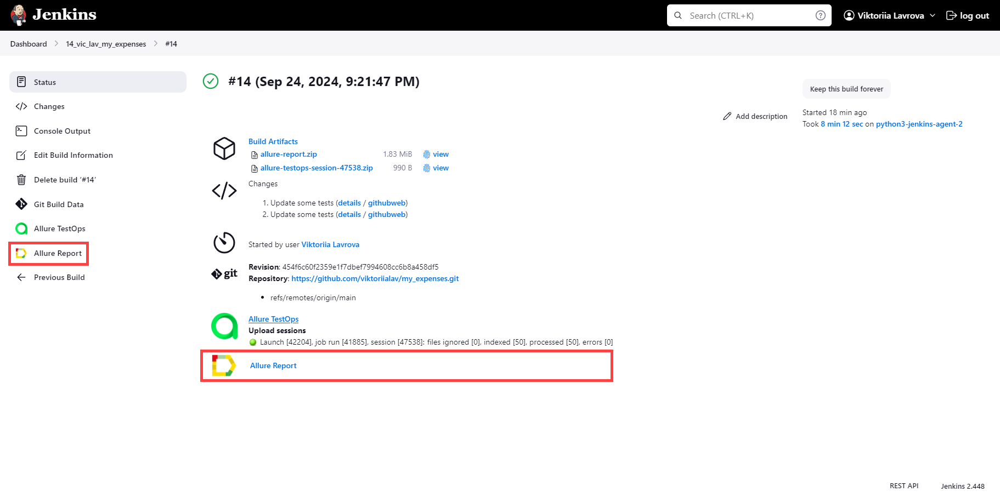
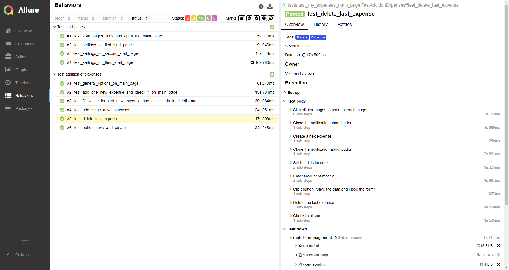
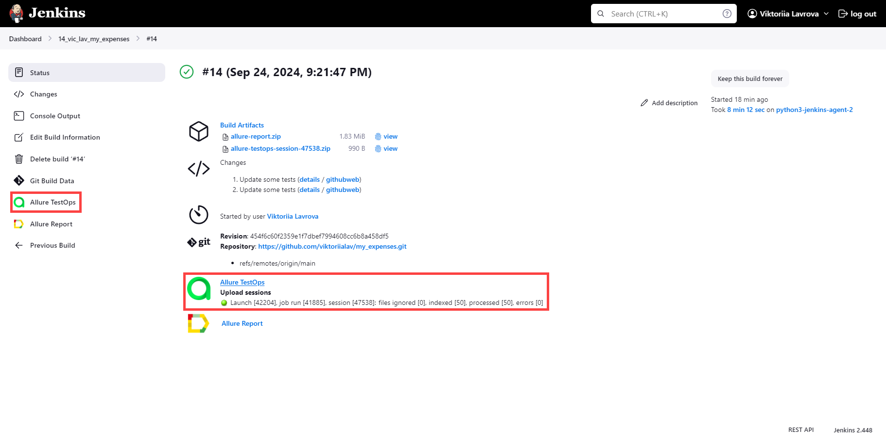
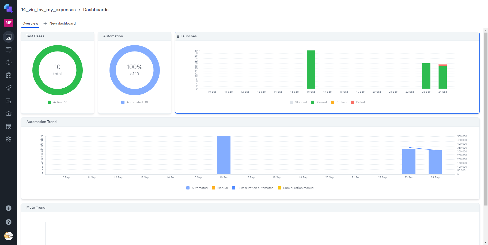
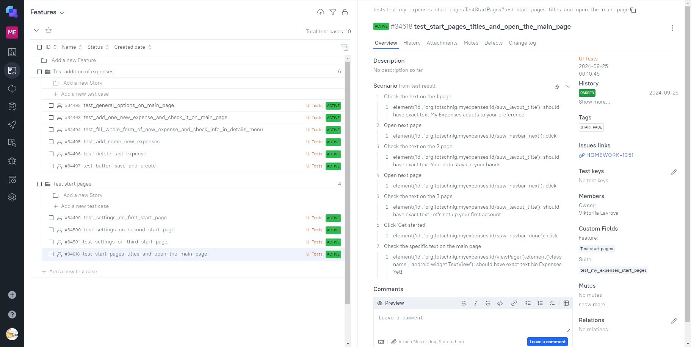
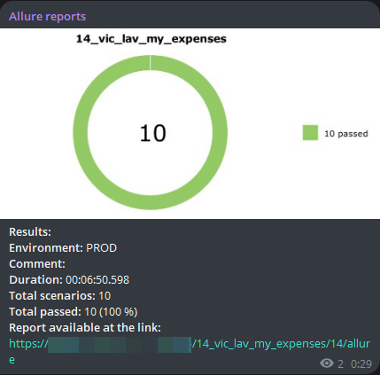

## Проект по автоматизации тестирования приложения My Expenses для Android
___
### :open_file_folder: Содержание:
- [Исходные данные](#item-1)
- [Цель проекта](#item-2)
- [Используемые технологии](#item-3)
- [Тесты](#item-4)
- [Сборка проекта и запуск тестов](#item-5)
- [Отчет о прохождении тестов](#item-6)
- [Уведомление о прохождении тестов](#item-7)
- [Видео о прохождении тестов](#item-8)
___
<a id="item-1"></a>
### :jigsaw: Исходные данные

[Cайт](https://www.myexpenses.mobi/ru/) с информацией о приложении и ссылками для скачивания с различных ресурсов.

<p align="center">

</p>

[Github MyExpenses](https://github.com/mtotschnig/MyExpenses) c кодом приложения.
___
<a id="item-2"></a>
### :dart: Цель проекта:

Тестирование основных функций приложения, позволяющих пользователю успешно настроить его под себя и 
использовать основной функционал.

___
<a id="item-3"></a>
### :desktop_computer: Используемые технологии

<table width="100%" border='0'>
  <tbody>
    <tr>
      <td>Язык программирования, IDE</td>
      <td align="center">
        <a target="_blank" href="https://www.python.org/">
          
        </a>
        <a target="_blank" href=https://www.jetbrains.com/pycharm/>
          
        </a>
      </td>
    </tr>
    <tr>
      <td>Библиотеки, фреймворки для написания тестов</td>
      <td align="center">
        <a target="_blank" href=https://appium.io/docs/en/latest/>
          
        </a>
        <a target="_blank" href=https://github.com/yashaka/selene>
          
        </a>
        <a target="_blank" href=https://docs.pytest.org/en/stable/index.html#>
          
        </a>
      </td>
    </tr>
    <tr>
      <td>Запуск тестов</td>
      <td align="center">
        <a target="_blank" href=https://www.jenkins.io/>
          
        </a>
        <a target="_blank" href=https://www.browserstack.com/>
          
        </a>
      </td>
    </tr>
    <tr>
      <td>Формирование отчета и отправление уведомлений</td>
      <td align="center">
        <a target="_blank" href=https://qameta.io/>
          
        </a>
        <a target="_blank" href=https://allurereport.org/>
          
        </a>
        <a target="_blank" href=https://www.atlassian.com/ru/software/jira>
          
        </a>
        <a target="_blank" href=https://telegram.org/>
          
        </a>
      </td>
    </tr>
  </tbody>
</table>

___
<a id="item-4"></a>
### :page_with_curl: Тесты

- Тестирование стартовых страниц и настроек:
  * Проверка заголовков всех стартовых страниц и открытия главной страницы после
  * Проверка настроек первой стартовой страницы
  * Проверка настроек второй стартовой страницы
  * Проверка настроек третьей стартовой страницы

- Тестирование основных функций главной страницы:
  * Наличие основных опций на главной странице
  * Добавление расхода/дохода
  * Добавление расхода/дохода со всеми заполненными полями и их проверка в детализации расхода/дохода
  * Добавление нескольких расходов/доходов
  * Удаление последнего расхода/дохода
  * Проверка работы функции "Save and create"


___

<a id="item-5"></a>

### :rocket: Сборка проекта и запуск тестов

Запустить проект можно как локально, так и удаленно. Далее приведены списки действий для обоих случаев.

Для запуска проекта удаленно с использованием **Jenkins** и **BrowserStack** необходимо:
- Создать новый проект в **Jenkins**
- Указать в настройках проекта **Source Code Management** в **Git** директорию текущего проекта и ветку `main`
- В **Build Steps**:
  * Создать файл `.env.bstack_credential` по примеру `.env.bstack_credential.example`, указав для него опции 
  **Create at Workspace**  и **Overwrite file** и получив значения **bstack_userName** и **bstack_accessKey** из 
  аккаунта в **BrowserStack** (подробнее по [ссылке](https://www.browserstack.com/docs/iaam/security/manage-access-keys))
  * Загрузить файл `*.apk` приложения в файловую систему **BrowserStack** (подробнее по [ссылке](https://www.browserstack.com/docs/app-automate/appium/upload-app-from-filesystem)) и полученную 
  ссылку указать в переменной `app` файла `.env.bstack_credential`
  * Создать **Execute shell** с кодом:
    ```shell
    python -m venv .venv
    source .venv/bin/activate
    pip install poetry
    poetry install --no-root
    context='bstack_android' pytest tests
    ```
  * В **Post-build Actions** добавить опцию **Allure Report** с указанием пути `allure-results`
  * Добавление синхронизации с **Allure TestOps** и добавление оповещений в **Telegram** может быть добавлено
  дополнительно

Вариант для преподавателей и учеников школы QA.GURU:
- Перейти по [ссылке](https://jenkins.autotests.cloud/job/14_vic_lav_my_expenses/) к проекту в **Jenkins**
- Нажать **"Build Now"**

<p align="center">

</p>

Для запуска проекта локально с использованием **BrowserStack** или **Android Studio** необходимо:
- Скачать проект и открыть его привычным способом
- Установить `poetry`, если не установлен*: `pip install poetry`
- Создать виртуальное окружение и установить зависимости
- Для запуска проекта в **BrowserStack**:
  * Создать файл `.env.bstack_credential` по примеру `.env.bstack_credential.example`, получив значения **bstack_userName**
и **bstack_accessKey** из аккаунта в **BrowserStack** (подробнее по [ссылке](https://www.browserstack.com/docs/iaam/security/manage-access-keys))
  * Загрузить файл `*.apk` приложения в файловую систему **BrowserStack** (подробнее по [ссылке](https://www.browserstack.com/docs/app-automate/appium/upload-app-from-filesystem)) и полученную 
ссылку указать в переменной `app` файла `.env.bstack_credential`
  * В терминале* ввести: `context='bstack_android' pytest tests`
- Для запуска проекта с использованием эмулятора из **Android Studio**:
  * Запустить **Appium** в **PowerShell**: `appium`
  * В **Android Studio** через **Virtual Device Manager** запустить один из созданных эмуляторов
  * В файле `.env.local_emulator` указать параметры, соответствующие запущенному эмулятору
  * В терминале* ввести: `context='local_emulator' pytest tests`
___

<a id="item-6"></a>

### :clipboard: Отчет о прохождении тестов


Отчет формируется в **Allure Report** автоматически после прохождения тестов.  
Если проект запущен удаленно, отчет можно открыть прямо из **Jenkins** для интересующего запуска проекта, кликнув на
иконку **Allure Report** в конкретном запуске или на странице проекта соответственно:

<p align="center">


</p>

В случае локального запуска проекта в терминале необходимо выполнить команду*:
```shell
allure serve allure-results
```
В обоих случаях откроется отчет, представленный ниже. На главной странице можно увидеть общую статистику.

<p align="center">

</p>

Более детальную статистику можно увидеть во вкладке **Graphs**.
<p align="center">


</p>

Посмотреть подробнее тест-кейсы можно во вкладке **Behaviors** (или **Suites**, или **Packages**).

<p align="center">

</p>

Для каждого теста представлены скриншот экрана в конце теста, xml-файл с копией дерева последней страницы теста и 
видео прохождения самого теста.

<p align="center">

</p>

Также для проекта в **Jenkins** настроена синхронизация с **Allure TestOps**. В нем можно отсортировать тест-кейсы 
необходимым образом, оформить баги, перезапустить тесты, которые не прошли, или запустить весь проект заново, 
выбрав необходимые параметры запуска, добавить ручные тест-кейсы и т.п.

Для того чтобы перейти в **Allure TestOps**, необходимо в конкретном запуске или на странице проекта 
кликнуть на иконку:  

<p align="center">


</p>


Общую информацию по всем запускам и тестам представлена во вкладке **Dashboards**.

<p align="center">

</p>

Общую информацию по тестам для конкретного запуска можно увидеть во вкладке **Launches**, кликнув на интересующий.

<p align="center">

</p>

Все тест-кейсы представлены по вкладке **Test cases** (см. левая часть изображения ниже). За счет того, что все тесты 
были написаны с разметкой `allure.steps`, мы имеем живую документацию, которая будет обновляться при изменении тестов. 
Пример такой документации для одного из тестов приведен ниже (см. правая часть изображения ниже).

<p align="center">

</p>


При необходимости можно отфильтровать тесты по какому-либо критерию. Ниже приведен пример для фильтрации по тегам 
`Add` и `Expense`.

<p align="center">

</p>

___

<a id="item-7"></a>

### :envelope_with_arrow: Уведомление о прохождении тестов

Проект в **Jenkins** настроен таким образом, чтобы уведомления приходили в конкретный чат приложения **Telegram**.

<p align="center">

</p>

___

<a id="item-8"></a>

### :film_projector: Видео о прохождении тестов

Ниже приведены видео о прохождении тестов, запущенных:

- удаленно на **BrowserStack** для первой группы тестов

<p align="center">

</p>

- удаленно на **BrowserStack** для второй группы тестов

<p align="center">

</p>


(*) - все команды указаны для **ОС** **Windows** при настройке использования **Git Bash** для терминала **PyCharm**